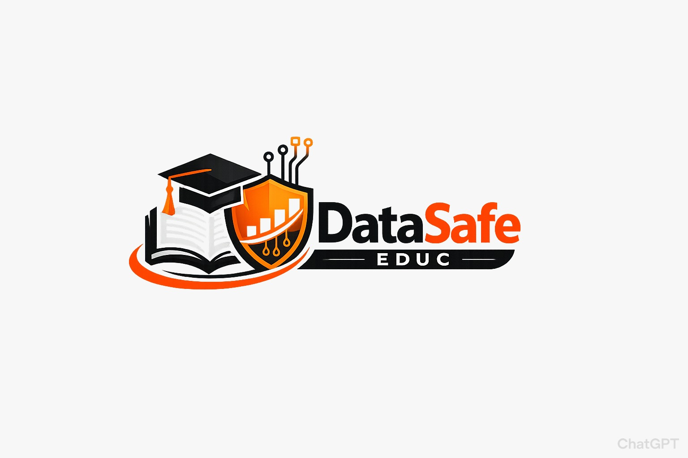

🎓 DataSafe Educ

  

O DataSafe Educ é uma plataforma inovadora de Inteligência de Dados voltada à gestão educacional pública. Utilizando análise estratégica de indicadores escolares, ajudamos gestores a identificar riscos de evasão com antecedência, permitindo decisões mais rápidas, assertivas e baseadas em evidências.

🚀 Funcionalidades

📊 Índice de Risco de Abandono (IRA) – Cálculo automatizado para identificar escolas e municípios em situação crítica; 
📈 Dashboards Interativos – Visualização clara e dinâmica dos indicadores educacionais; 
🎯 Monitoramento Preventivo – Análise periódica para antecipar cenários de evasão; 
🔐 Acesso Seguro – Plataforma com autenticação para usuários governamentais; 
📚 Baseado em Dados Oficiais – Utilização de indicadores educacionais públicos para geração de inteligência estratégica; 

🌟 Sobre a Plataforma

O DataSafe Educ nasce com o propósito de transformar dados educacionais em inteligência aplicada à gestão pública.

A evasão escolar não acontece de forma repentina — ela é precedida por sinais como queda no desempenho, baixa frequência e vulnerabilidade social. A plataforma organiza esses dados e os converte em alertas estratégicos, permitindo intervenção antes que o abandono se concretize.

Missão: Reduzir a evasão escolar por meio de análise preventiva e tomada de decisão baseada em dados; 

Visão: Ser referência nacional em inteligência educacional e apoio à gestão pública; 

Valores: Inclusão social, responsabilidade pública, inovação, precisão analítica e compromisso com o impacto social; 

🎯 Impacto Esperado

✔ Redução das taxas de evasão escolar
✔ Tomada de decisão mais ágil e estratégica
✔ Melhor direcionamento de políticas públicas
✔ Uso eficiente de recursos educacionais
✔ Fortalecimento da permanência escolar
